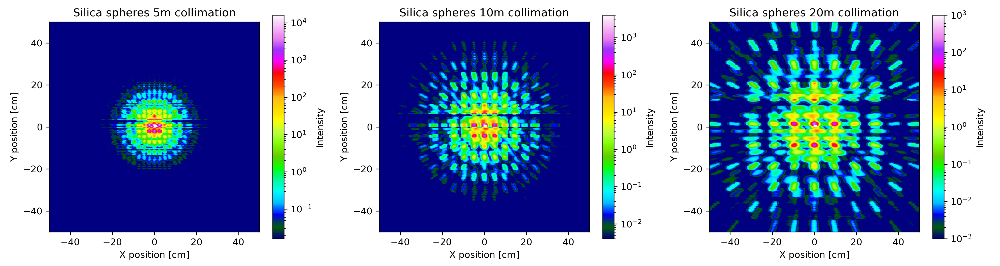
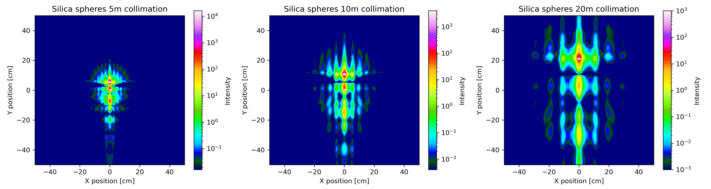
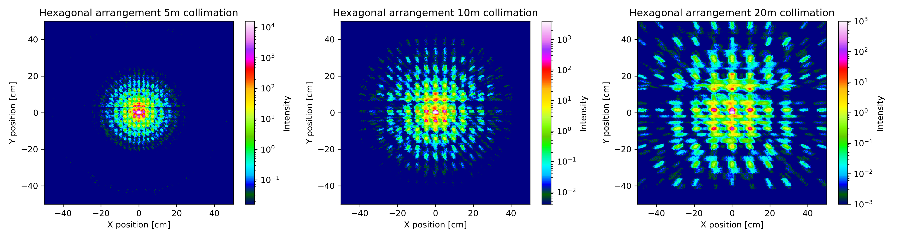
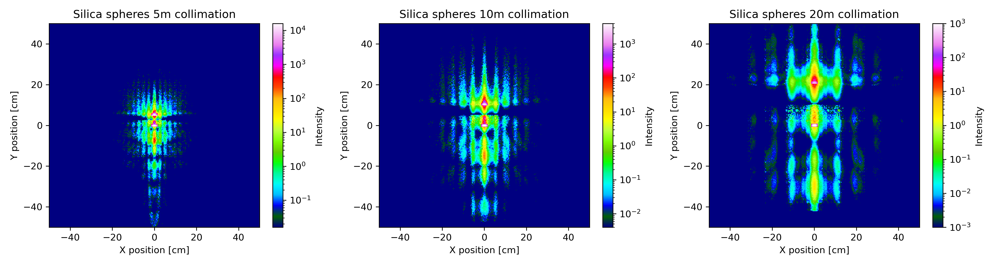

Project to model GISANS samples within McStas

Installation
============

Windows
-------

* Clone repository 
* Install [McStas 3.3 metapackage](https://download.mcstas.org/mcstas-3.3/windows/McStas-Metapackage-3.3-win64.exe) or newer
* Use anaconda to create an environment from the `conda.yml` file

Debian/Ubuntu (glibc >=2.31)
----------------------------

* Create a virtual environment and activate it
* Install python requirements
* Add McStas repository and install it

In directory where repository was cloned:
```bash
sudo -E wget https://packages.mccode.org/debian/mccode.list -P /etc/apt/sources.list.d
sudo apt update
sudo apt install mcstas-suite-python

sudo apt install python3-venv
python3 -m venv venv
source venv/bin/activate
pip install  -r requirements.txt
```

Other Systems
-------------

The installation process will be different, but the code should work, too.


Simulation
==========

Server
------

Start the BornAgain simulation service using python:

```bash
python BAserver.py
```

This creates a local service waiting for McStas to send events for simulations.

Client
------

For an installation on Windows as described above, the jupyter notebook `ExecuteSimulation.ipynb` can
be executed using the newly created anaconda environment with `jupyter notebook`.
This should open a browser windows where you can open the file.

For Linux there is a bash script to run the simulations, `run_mcstas.sh`. For the reference
BornAgain simulations one can sue `run_reference.sh`.

Results
=======

Plots
-----

PlotMcStasResults.ipynb: IPython notebook plotting McStas results using the `mcstas_reader.py`
module and matplotlib.

Resulting images will be saved in the `plots` directory.

Reference BornAgain
-------------------
Two models have been included and simulated directly using BornAgain with
a wavelength spread and divergence as given by the SANS instrument geometry
in McStas as well as the same incident intensity before the Sample.
A 3-Layer hexagonal lattice of Sapphire spheres and a single layer of Silica spheres.




McStas integration
------------------
The same models were simulated with McStas using event-by-event BornAgain simulation.
Resolution effects follow directly from the McStas incident beam distribution.

Each simulation uses 1000 incident particles that are split 443 times at the sample.




Comparison with the plane BornAgain simulation shows that the scattering intensity is
properly preserved for all examples, event with modest incoming beam statistics.
For real instrument simulations the statistics can easily be increased by 10x.

Limitations
===========

* A known limitation is a restriction to reflect from the top of the sample, 
  otherwise the BornAgain simulation will crash.
* Although simulations run on individual processes and thus MPI McStas gives 
  the expected speedup, all communication is managed by a single python process.
  It is therefore expected that the gain will level off at a certain number of
  MPI processes. On a laptop this was not observed using 8 processes.